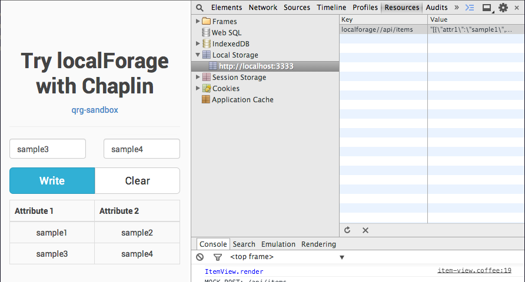

try-localforage
===============

Overview
---------------



Try [localforage](https://github.com/mozilla/localForage) with Chaplin.

* CoffeeScript
* Jade
* Sass
* [Chaplin](http://chaplinjs.org/)
* [localforage](https://github.com/mozilla/localForage)

Installation
---------------

``` sh
$ gem install sass
$ npm install -g brunch bower coffee-script
$ npm install && bower install
```

Try
---------------

``` sh
$ ulimit -n 10000
$ brunch watch --server
```

Open `http://localhost:3333`.


Note
---------------

Using only localStorage, not IndexedDB.
There is a bug in Chrome 35 with IndexedDB.

ref.) [Bug in Chrome preventing setItem in onbeforeunload and unload events · Issue #131 · mozilla/localForage](https://github.com/mozilla/localForage/issues/131)
